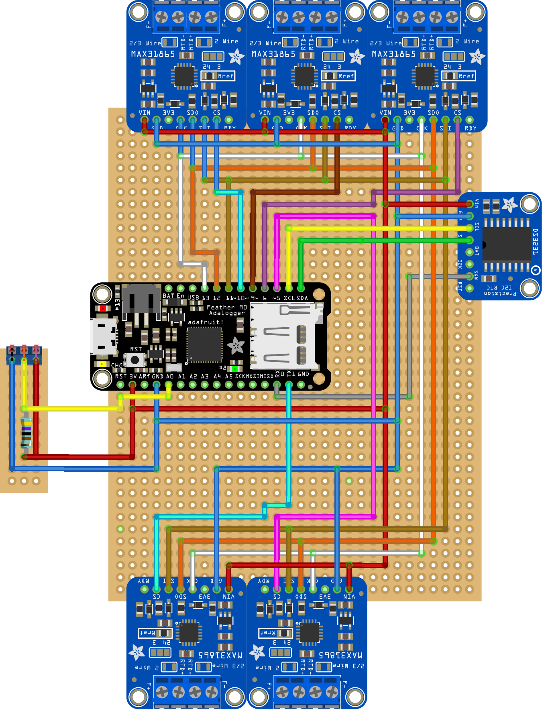
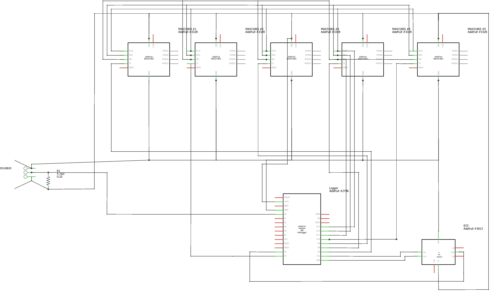

# Temperature Logger

This projet was realized during a mendatory civil service for the RISK group of the the institute of earth sciences (ISTE) of Lausanne University (UNIL) in 2021 and 2022.

The goal is to measure temperature at different depth in a rock for several months. With this version we can log 6 temperatures sensors relatively precisely and log this data on an SD card. The logger should be able to run for several months outside.

# Material
| Part                                               | Quantity |
|----------------------------------------------------|----------|
| Adafruit Feather M0 Adalogger                      | 1        |
| Adafruit MAX31865 PT1000                           | 5        |
| Adafruit DS3231 Precision RTC Breakout             | 1        |
| Platinum RTD Sensor - PT1000 - 3 Wire 1 meter long | 5        |
| 1-Wire DS18B20                                     | 1        |
| Solar Panel                                        | 1        |
| 5V Buck Converter Unit(ME3116AM6G)                 | 1        |
| USB / DC / Solar Lithium Ion/Polymer charger       | 1        |
| 4.7k Ohm Resistor                                  | 1        |
| Waterproof-Box                                     | 1        |
| 3-Pin IP67 Connector (for the Temperature sensors) | 6        |
| 2-Pin IP67 Connector (for the solar Panel)         | 1        |
| Micro-SD card                                      | 1        |
| Custom PCB                                         | 1        |

# Library Used
|   Library   |  Version  |
|-------------|-----------|
|[RTCZero.h](https://www.arduino.cc/reference/en/libraries/rtczero/)|1.6.0|
|[DS3231.h](https://www.arduino.cc/reference/en/libraries/ds3231/)|1.1.0|
|[Wire.h](https://github.com/esp8266/Arduino/blob/master/libraries/Wire/Wire.h)|1.0.0|
|[Adafruit_MAX31865.h](https://github.com/adafruit/Adafruit_MAX31865)|1.5.0|
|[DS3232RTC.h](https://github.com/JChristensen/DS3232RTC)|2.0.1|
|[DallasTemperature.h](https://github.com/milesburton/Arduino-Temperature-Control-Library)|3.9.0|
|[Onewire.h](https://www.arduino.cc/reference/en/libraries/onewire/)|2.3.7|
|[SD.h](https://www.arduino.cc/reference/en/libraries/sd/)|1.2.4|
|[SPI.h](https://www.arduino.cc/reference/en/language/functions/communication/spi/)|1.7.10|
# Board package
You also need the additional board package for the Adafruit SAMD Boards.
## In Visual Studio Code:
1. Install Arduino in the extension tab
2. With _control+shift+p_ write _>Arduino: Board Manager_
3. Click _Additional URLs_ and add 
> https://adafruit.github.io/arduino-board-index/package_adafruit_index.json
4. With _control+shift+p_ write _>Arduino: Board Config_
5. As board select: __Adafruit Feather M0 (SAMD21) (Adafruit SAMD Boards)_

## In Arduino IDE:
1. Open _Preferences_
2. In _Additional Boards Manager URLs_ add:
> https://adafruit.github.io/arduino-board-index/package_adafruit_index.json
3. In _tools_ > _Card type_ > _Adafruit Feather M0 (SAMD21)_ 

Additional board packages are available once
>https://adafruit.github.io/arduino-board-index/package_adafruit_index.json

is added in "Additional Boards Manager URLs" in "Preference" on the Arduino IDE or 

# Circuit
A friting file is available and a PCB can be produced from the file.
|Circuit                    |Schematic                      |PCB                 |
|---------------------------|-------------------------------|--------------------|
||||

# Ports configuration
| Feather M0 Port        | Corresponding Port        | | Feather M0 Port        | Corresponding Port        |
|------------------------|---------------------------| |------------------------|---------------------------|
| D0                     | RTC DS3231 (SQW)          | | D12                    | MAX31865 #1-#5 (SDO)      |
| D1                     | MAX31865 #2 (CS)          | | D13                    | MAX31865 #1-#5 (CLK)      |
| D5                     | MAX31865 #1 (CS)          | | A0                     | DS18B20 (DATA)            |
| D6                     | MAX31865 #4 (CS)          | | SCL                    | RTC DS3131 (SCL)          |
| D9                     | MAX31865 #3 (CS)          | | SDA                    | RTC DS3131 (SCA)          |
| D10                    | MAX31865 #5 (CS)          | | 3.3V                   | All Vin ports             |
| D11                    | MAX31865 #1-#5 (SDI)      | | GND                    | All GND ports             |

# Parameters
The main parameters are declared at the start of LowPowerLogger.ino
> _SampleIntSec_: Define the sampling interval (Default: 60) \
> _SamplesPerCycle_: Define after how many samples we flush the log (as flushing once per sampling wouldn't be too consuming) (Default: 10)\
>_NUM_MAX31865_: Number of MAX31865 (Default: 5)\
>_RREF1...5_: Default reference resistor value of MAX31865 (Default: 4300)\
>_RNOMINAL_: Default nominal resistor value of MAX31865 (Default: 1000)\
>_AVERAGE_MEASURES_: Number of measures taken form MAX31865 averaged for one measure (Default: 10)\

# Usage
Always unplug the 2-pin JST connector from the USB/DC/Solar Lithium Ion/Polymer charger before plugging-in a __micro-USB__  cable.
## Standalone (Only writing on the SD card)
Download LowPowerLogger.ino on the Arduino with line 11 commented.
>_//#define ECHO_TO_SERIAL_
1. Unconnect the micro-usb
2. Plug-in the micro-SD card
3. Plug-in the 2-pin JST connector from the USB/DC/Solar Lithium Ion/Polymer 
If you remove the micro-SD card while the battery is plugged in, remember to push the reset button of the Arduino once the micro-SD card is back in.

## With a computer (Writing on the SD card and Serial)
Uncomment the line 11 of LowPowerLogger.ino
>_#define ECHO_TO_SERIAL_

And setup the serial monitor to the baude rate of 115200
Do not plug in the JST connector to the USB/DC/Solar Lithium Ion/Polymer charger

## Recharching battery
Use a __mini-USB__ cable, pluged-in the USB/DC/Solar Lithium Ion/Polymer charger to recharge the battery.

## Important notice
**Never connect the micro-USB cable to the board if the USB/DC/Solar Lithium Ion/Polymer charger JST Connector is plugged in as the module does not have a protection diode.**
