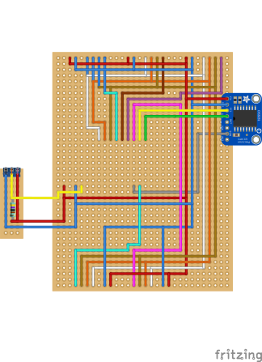
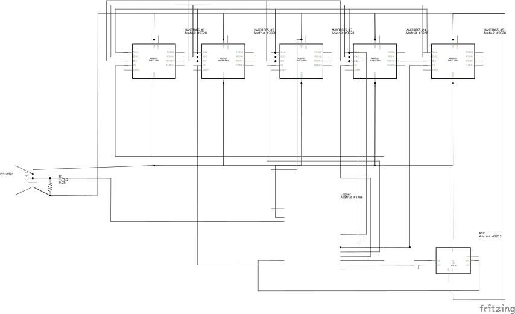

# Temperature Logger

This projet was realized during a mendatory civil service for the RISK group of the the institute of earth sciences (ISTE) of Lausanne University (UNIL).

The goal is to measure temperature at different depth in a rock for several months. With this version we can log 6 temperatures sensors relatively precisely and log this data on an SD card. The logger should be able to run for several months outside.

# Material
| Part                                               | Quantity |
|----------------------------------------------------|----------|
| Adafruit Feather M0 Adalogger                      | 1        |
| Adafruit MAX31865 PT1000                           | 5        |
| Adafruit DS3231 Precision RTC Breakout             | 1        |
| Platinum RTD Sensor - PT1000 - 3 Wire 1 meter long | 5        |
| 1-Wire DS18B20                                     | 1        |
| Solar Panel                                        | 1        |
| 5V Buck Converter Unit(ME3116AM6G)                 | 1        |
| 4.7k Ohm Resistor                                  | 1        |
| Box                                                | 1        |
| 3-Pin IP67 Connector (for the Temperature sensors) | 6        |
| 2-Pin IP67 Connector (for the solar Panel)         | 1        |

# Library Used
1. [RTCZero.h](https://www.arduino.cc/reference/en/libraries/rtczero/)
2. [DS3231.h](https://www.arduino.cc/reference/en/libraries/ds3231/)
3. [Wire.h](https://github.com/esp8266/Arduino/blob/master/libraries/Wire/Wire.h)
4. [Adafruit_MAX31865.h](Adafruit_MAX31865.h)
5. [DS3232RTC.h](https://github.com/JChristensen/DS3232RTC)
6. [DallasTemperature.h](https://github.com/milesburton/Arduino-Temperature-Control-Library)
7. [Onewire.h](https://www.arduino.cc/reference/en/libraries/onewire/)
7. [SD.h](https://www.arduino.cc/reference/en/libraries/sd/)
8. [SPI.h](https://www.arduino.cc/reference/en/language/functions/communication/spi/)

# Circuit
A friting file is available and a PCB can be produced from the file.
|Circuit                    |Schematic                      |PCB                 |
|---------------------------|-------------------------------|--------------------|
||||
